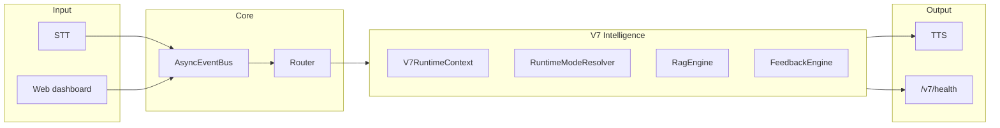

# ATOM — Code Review, System Report & Desktop Migration Plan

**Document purpose:** Single reference for architecture understanding, what was hardened for production-grade behavior (V7), what was validated without full runtime, and how to migrate to a personal desktop safely.

**Owner:** Satyam  
**Codebase root:** `ATOM/` (entry: `main.py`)

---

## 1. Executive summary

ATOM is a **local-first, event-driven cognitive OS** for voice + optional local LLM, with a security-gated router, web dashboard, and layered intelligence (intent → cache/memory → RAG/graph → LLM). The **V7 intelligence layer** adds explicit runtime context, mode stability, feedback-driven metrics, observability (`/v7/health`, `v7_*` logs), bounded prefetch, graph-first validation with fallback, and preemption limits.

**Authoritative long-form architecture:** [`ATOM_ARCHITECTURE_BLUEPRINT.md`](../ATOM_ARCHITECTURE_BLUEPRINT.md)  
**Upgrade roadmap:** [`ATOM_V2_UPGRADE_PLAN.md`](../ATOM_V2_UPGRADE_PLAN.md) (if present)

---

## 2. High-level architecture

| Layer | Role | Key paths |
|-------|------|-----------|
| Entry | Async `main()`, event bus, wiring | `main.py` |
| Perception | STT, mic, optional wake word | `voice/` |
| Understanding | Intent, cache, skills, context | `core/` (`intent_engine`, `router`, `cache_engine`, …) |
| Cognition | Predictor, feedback, preemption, suggester | `core/cognition/` |
| Brain | Local LLM + ReAct + tools | `brain/`, `cursor_bridge/local_brain_controller.py` |
| Memory / RAG | Timeline, MemoryGraph, RagEngine, prefetch | `core/memory/`, `brain/memory_graph.py`, `core/rag/` |
| Runtime | FAST/SMART/DEEP/SECURE resolution | `core/runtime/modes.py`, `core/runtime/v7_context.py` |
| Observability | Debug snapshot, warnings, stress hooks | `core/observability/` |
| UI | aiohttp dashboard + WebSocket | `ui/web_dashboard.py` |
| Security | Policy gate on actions (do not weaken casually) | `core/security_policy.py`, `core/router/router.py` |

---

## 3. V7 hardening (implemented)

| Area | Behavior | Primary files |
|------|----------|----------------|
| Context | `V7RuntimeContext` carries system, feedback, mode, timeline summary | `core/runtime/v7_context.py`, `cursor_bridge/local_brain_controller.py` |
| Mode stability | Cooldown + significance; `v7_mode_switch` logs | `core/runtime/modes.py` |
| Feedback | Rolling windows, trends, `get_health_status()`, noise gates, graph/prefetch metrics | `core/cognition/feedback_engine.py` |
| Prefetch | Soft scale (delay, fewer candidates); hard GPU abort threshold | `core/rag/prefetch_engine.py` |
| Graph vs RAG | `relevance_validation_min`; miss tracking; one-shot skip graph | `core/rag/rag_engine.py` |
| Preemption | Last score exposure; `max_preemptions_per_query` | `core/cognition/preemption.py`, `local_brain_controller.py` |
| Observability | Cached snapshot, periodic `v7_debug_snapshot` | `core/observability/debug_snapshot.py`, `main.py` |
| Health API | `GET /v7/health` JSON | `ui/web_dashboard.py`, `main.py` |
| Config | Thresholds under `v7_intelligence.*` | `config/settings.json`, `core/config_schema.py` |

---

## 4. Configuration contract

- **Primary config:** `config/settings.json` — validated by `core/config_schema.py` (`validate_config`).
- **Examples:** `config/settings.desktop.example.json`, `config/settings.corporate.example.json`.
- **Critical groups:** `owner`, `brain`, `stt`, `tts`, `performance`, `v7_intelligence`, `rag`, `v7_gpu`, `ui` (e.g. `web_port` for dashboard and `/v7/health`).

---

## 5. Static validation (no full ATOM run)

Suitable on restricted machines:

| Check | Command / action |
|-------|------------------|
| JSON valid | Parse `config/settings.json` |
| Schema | `validate_config(config)` from `core.config_schema` |
| Syntax | `python -m compileall` over `ATOM/` |
| Import surface | `cd ATOM && python -c "import main"` (does not start `asyncio.run`; only stdlib imports at top of `main.py`) |

**Does not replace:** runtime tests, `/v7/health` with live process, STT/TTS/GPU/LLM integration.

---

## 6. Desktop migration checklist (personal machine)

When moving from “build-only” corporate laptop to your own desktop:

1. **Python:** 3.11+ 64-bit recommended; match what you used for development if possible.
2. **Dependencies:** Use [`requirements-desktop.txt`](../requirements-desktop.txt) (same pins as production `requirements.txt`, documented for desktop). Install in a **venv** dedicated to ATOM.
3. **Config:** Start from `config/settings.json` or `config/settings.desktop.example.json`; set `brain.model_path` to your GGUF path; tune `v7_intelligence` after observing `/v7/health`.
4. **GPU (optional):** CUDA-capable NVIDIA + drivers; `llama-cpp-python` may need a wheel matching your CUDA/CPU. See comments in `requirements.txt` for build notes.
5. **First boot:** Run `python main.py` once; open `http://127.0.0.1:<web_port>/v7/health` (default port from `ui.web_port`, often `8765`).
6. **Validation phases:** Use the structured playbook (trust baseline → light load → learning → failure injection → observability) when you are allowed to run the full stack.

---

## 7. Known gaps / future work (non-blocking)

| Topic | Notes |
|-------|--------|
| Timeline summarization | Long sessions: deque caps size but does not merge old events into semantic summaries (Phase 4+). |
| Full config↔code audit | Manual trace of every `settings.get` key is large; optional hygiene pass. |
| `dry_run` / pipeline without LLM | Not implemented; would be a feature flag + wiring change for safe integration tests. |

---

## 8. Security & policy

- **SecurityPolicy / `allow_action`:** Central enforcement; treat changes as high-risk review.
- **Corporate policy:** Running local LLMs, microphones, and localhost HTTP may be restricted on work hardware — follow employer rules; use personal desktop for full integration tests when appropriate.

---

## 9. File index (quick navigation)

| File | Purpose |
|------|---------|
| `main.py` | Application entry, `run_atom()` |
| `config/settings.json` | Live configuration |
| `core/config_schema.py` | JSON Schema + validation |
| `ATOM_ARCHITECTURE_BLUEPRINT.md` | Deep architecture |
| `README.md` | User-facing quick start |
| `requirements-desktop.txt` | Desktop install list (this repo) |
| `docs/ATOM_Deployment_Profiles.md` | Deployment profiles |

---

## 10. Revision

This document reflects the repository state at authoring time. Update section 3 when major subsystems change.
