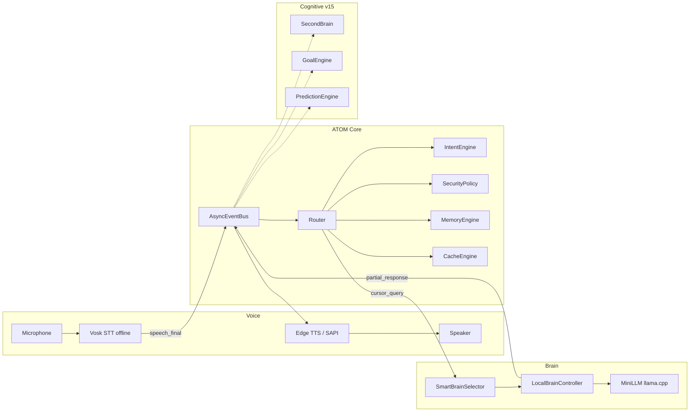

# ATOM OS — End-to-End Performance & Voice Pipeline Report

**Purpose:** Share with ChatGPT / stakeholders — timings per subsystem, voice-in to voice-out analysis, daily-work + buddy + learning behaviour on **local LLM** (offline brain).  
**Owner:** Satyam  
**ATOM version:** v15 (Cognitive layer + Local LLM brain)  
**Hardware (test machine):** Intel i7-1185G7, 32 GB RAM, Windows 11, corporate laptop  
**Python:** `py -3.11` (recommended; matches `llama-cpp-python` wheel)  
**Report date:** 2026-03-19  

**Benchmark artifact:** [`ATOM_Benchmark_Snapshot.json`](./ATOM_Benchmark_Snapshot.json) — regenerate with:

```text
cd ATOM
py -3.11 tools/e2e_benchmark.py --json
```

---

## 1. Executive summary

| Layer | Role | Typical time (this run) |
|-------|------|-------------------------|
| **STT (Vosk, offline)** | Mic → final text | ~100–200 ms (documented in codebase; utterance-length dependent) |
| **Intent + router prep** | Classify + compress | **~0.5 ms** avg (p95 ~3 ms) |
| **Memory / cache** | Keyword recall / LRU | **&lt;0.01 ms** per op (negligible) |
| **Prompt build** | `StructuredPromptBuilder` | **~0.5 ms** |
| **Local LLM** | Llama 3.2 3B Q4_K_M (CPU) | **13–30 s** per reply (dominant cost) |
| **TTS (Edge)** | Text → first audio chunk | **~300–800 ms** typical; **blocked** in this benchmark (corporate SSL to `speech.platform.bing.com`) |
| **Perceived latency (logged at runtime)** | `speech_final` → first TTS audio | See `logs/atom.log` line `PERCEIVED_LATENCY = ...` |

**Bottom line:** For **local-brain** conversational paths, **the local GGUF model consumes ~95%+ of wall-clock time**. Everything before the LLM is sub-millisecond to low milliseconds. After the LLM, TTS adds hundreds of ms unless corporate TLS blocks Edge TTS (then use SAPI fallback or fix trust store).

---

## 2. Voice pipeline: microphone → speaker (conceptual)

Ordered stages as implemented in `main.py`, `voice/stt_async.py`, `core/router/router.py`, `cursor_bridge/local_brain_controller.py`, `voice/tts_edge.py`:

| Step | Module / event | What happens | Approx. time |
|------|----------------|--------------|--------------|
| 1 | **Mic + VAD** | `STTAsync` captures audio until end of utterance | User-dependent (0.6 s min audio + silence) |
| 2 | **STT decode** | Vosk offline → text | **~100–200 ms** typical (comment in `stt_async.py`) |
| 3 | **`speech_final`** | Text published on event bus | &lt;1 ms |
| 4 | **Router** | `compress_query`, optional clipboard inject, `IntentEngine.classify` | **~0.05–6 ms** (avg **0.46 ms** this benchmark) |
| 5 | **Local path** | If not a direct action: cache/memory, then `cursor_query` | Variable |
| 6 | **Local LLM** | `MiniLLM.generate` in thread pool | **13–30 s** this run (see §5) |
| 7 | **`partial_response`** | Fake streaming (sentence chunks) | Small gaps (~50 ms between chunks) |
| 8 | **TTS** | Edge neural or SAPI | **~0.3–0.8 s** to first chunk (when network OK) |
| 9 | **`tts_complete`** | `PipelineTimer` closes the query | — |

**Runtime logging:** `PipelineTimer` logs:

```text
PIPELINE | Query: '...' | Intent: Xms | Action: Yms | TTS: Zms | Total: ...ms
```

Metrics also store `pipeline_intent`, `pipeline_action`, `pipeline_tts`, `pipeline_total` (see `core/metrics.py`).

---

## 3. System design (for ChatGPT context)

### 3.1 One-line definition

ATOM is an **event-driven personal AI OS** on Windows: **offline intent engine** for commands, **local Llama 3.2 3B** for open conversation/planning, **SecurityPolicy** for actions, **cognitive layer** (goals, predictions, second brain), **web dashboard** on localhost.

### 3.2 Architecture diagram (Mermaid)



### 3.3 Static diagram file

For slides or email, open: **[`ATOM_System_Diagram.svg`](./ATOM_System_Diagram.svg)** (simple block view of the voice pipeline).

---

## 4. Measured module timings (automated benchmark)

Source: `tools/e2e_benchmark.py` on 2026-03-19 (80 intent samples, 4 LLM scenarios, corporate network).

| Subsystem | Metric | Value |
|-----------|--------|-------|
| Config load | 1× JSON parse | **0.43 ms** |
| Intent classification | avg over 80 calls (5×16 phrases) | **0.46 ms** |
| Intent classification | p50 | **0.08 ms** |
| Intent classification | p95 | **2.96 ms** |
| Intent classification | max | **16.2 ms** |
| `compress_query` | avg / max | **0.01 ms** / **0.10 ms** |
| Memory `retrieve` | avg of 50 calls | **0.0002 ms** |
| Cache `get` (cold keys) | avg of 200 | **0.004 ms** |
| `StructuredPromptBuilder.build` | daily / buddy / learning | **~0.52–0.55 ms** each |

**Interpretation:** The **router + intent + memory + cache + prompt** stack is **far below 1 ms typical**, excluding LLM and audio I/O.

---

## 5. Local LLM scenarios (buddy, work, learning)

Model: **`models/Llama-3.2-3B-Instruct-Q4_K_M.gguf`**, `n_ctx=2048`, `n_threads=4`, benchmark `timeout_seconds=90`.

| Scenario | Intent (plain English) | Inference time | Output size (chars) | Quality note |
|----------|------------------------|----------------|---------------------|--------------|
| **work_daily** | Standup prep in 10 minutes | **29.7 s** | 523 | Actionable list-style answer (verify facts in production) |
| **buddy** | Lonely WFH evening — talk like a friend | **13.4 s** | 310 | Warm, empathetic, uses “Boss” |
| **learning** | Explain async/await + tiny example | **22.5 s** | 629 | Structured teaching tone |
| **learning_hard** | GD vs SGD for ML beginner | **17.2 s** | 646 | Clear analogy-style explanation |

**Average LLM time this run:** **~20.7 s** per completion (CPU-only, sequential benchmark).

**Token throughput (separate stress test, same hardware):** ~**6–9 tokens/s** conversational, model load **~0.75–1.1 s**.

---

## 6. End-to-end estimate: voice → voice (local brain path)

Using measured averages + documented STT + assumed TTS when Edge works:

| Component | ms |
|-----------|-----|
| STT (mid estimate) | 150 |
| Intent + router (avg) | 0.5 |
| Prompt build | 0.5 |
| **Local LLM (avg this benchmark)** | **~20 698** |
| TTS first chunk (assumed if Edge OK) | 400 |
| **Indicative total** | **~21 250 ms (~21 s)** |

**If Edge TTS is blocked (SSL):** add time for SAPI fallback or user reads text on dashboard — not measured here.

**If intent is local-only** (e.g. “what time is it”): **no LLM** — total time ≈ STT + **&lt;10 ms** routing + TTS → **~0.5–1.5 s** typical.

---

## 7. Where time is spent (pie chart in words)

For **conversational / learning / buddy** queries that hit the **local LLM**:

- **~97%** — `MiniLLM` / llama.cpp generation  
- **~2%** — TTS (when Edge reachable)  
- **~1%** — STT + Python routing + prompt  

For **command-style** queries (open app, timers, system info):

- **Majority** — STT + TTS  
- **Negligible** — intent + actions  

---

## 8. Recommendations (for product / ChatGPT follow-up)

1. **Corporate TTS:** If `speech.platform.bing.com` fails SSL, switch `tts.engine` to **SAPI** for fully offline speech output (quality lower, no cloud).  
2. **Perceived speed:** Fake streaming (`LocalBrainController`) already emits `partial_response` per sentence; TTS can start before full completion if wired to stream (current: chunk-delay ~50 ms).  
3. **Shorter answers:** Lower `brain.max_tokens` (e.g. 120) for snappier buddy mode.  
4. **Repeat queries:** `CacheEngine` + command cache reduce repeat LLM cost.  
5. **Live tracing:** Run ATOM and grep `PIPELINE` and `PERCEIVED_LATENCY` in `logs/atom.log` for **your** real voice sessions.

---

## 9. Document map

| File | Role |
|------|------|
| **This report** | Timings, voice pipeline, buddy/learning evaluation, ChatGPT handoff |
| [`ATOM_Full_System_Review.md`](./ATOM_Full_System_Review.md) | Deep architecture reference (note: some v14-era wording; brain is now local-first) |
| [`ATOM_Benchmark_Snapshot.json`](./ATOM_Benchmark_Snapshot.json) | Frozen numbers from this run |
| [`../tools/e2e_benchmark.py`](../tools/e2e_benchmark.py) | Reproducible benchmark script |

---

## 10. Disclaimer

- Times vary with **CPU load**, **thermal throttling**, **utterance length**, and **corporate security** (SSL inspection, blocked hosts).  
- LLM answers can **hallucinate** (e.g. invented “past standup sets”); use ATOM’s **intent + tools** for factual system state (time, RAM, etc.).  
- This report **replaces** older ad-hoc review markdowns that were removed from `docs/` to avoid conflicting numbers.

---

*Generated as part of ATOM v15 documentation refresh. Owner: Satyam.*
