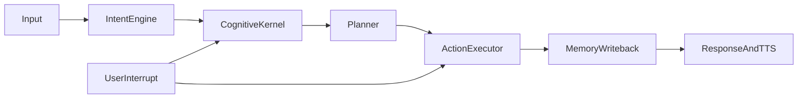

# ATOM Implementation Plan — ACT Protocol & Progress

**Purpose:** Single source of truth for phased stabilization. Update this file when each step completes so progress stays visible in git.

**Repo:** `/Users/satyamyadav/Desktop/Personal/ATOM`  
**Platform:** macOS (Apple Silicon) only.

---

## How to advance work: the ACT command

When you want the assistant to **implement** the next planned step (not just discuss it), say one of:

- **“Next step ACT”** or **“Move to the next step ACT”** or **“ACT step N”** (e.g. `ACT step 1`)

**What ACT means for the agent:**

1. **Read** this document and identify the **next** step whose status is not `done` (or the explicit step number if given).
2. **Implement** that step in code: follow existing patterns in the codebase, read surrounding modules first, keep changes minimal and testable.
3. **Verify** with targeted checks (import/smoke test, or existing `tests/` where relevant); do not leave the tree broken.
4. **Update tracking** in this file: set the step to `done`, set **Current step** below, append a line to **Change log** with date and short summary.
5. **Update** the YAML/frontmatter todos if your tooling uses `.cursor/plans/` — keep IDs in sync with **Step IDs** below.

**What ACT does *not* mean:** vague refactors, deleting large areas without verification, or skipping the progress update.

---

## Current step

| Field | Value |
|-------|--------|
| **Active step ID** | `jarvis-state-stabilization` |
| **Last completed** | `jarvis-state-stabilization` |
| **Last updated** | 2026-04-13 |

---

## Progress tracker

| Step ID | Phase | Status | Notes |
|---------|-------|--------|-------|
| `cleanup-inventory` | 0 | done | Deletion inventory defined |
| `cleanup-batch-one` | 0 | done | Safe artifacts removed; README/docs/.gitignore updated |
| `runtime-truth` | 1 | done | CognitiveKernel before LocalBrain/RAG; InferenceGuard attach deferred; boot logging |
| `macos-perception` | 2 | done | `context_darwin.py`: Quartz+AppKit window, NSPasteboard/`pbpaste`; Win32 gated |
| `consolidation` | 3 | done | `docs/ARCHITECTURE_CANONICAL.md`; removed dead `ReasoningPlanner` init; brain legacy docstrings |
| `interrupt-control` | 4 | done | Queue clear on interrupt; MLX `is_generating`; WS `execution_state` |
| `performance` | 5 | done | Pipeline LLM first-partial; cache eviction metric + stats; UI cache fill |
| `memory-context` | 6 | done | Fusion ST/timeline/LT hint; `MEMORY_CONTEXT_LAYERS.md`; `format_scored_for_prompt` |
| `proactive-intelligence` | 7 | done | `ProactiveInsightQuota` + audit; `jarvis_core.wire_intelligence` from main; goals in Jarvis |
| `security-hardening` | 8 | done | `security_tiers` + `strict` cap; Unix shell blocks + pipe-to-shell; `SECURITY_SETUP.md` |
| `experience-layer` | 9 | done | Dashboard experience line + title/placeholder; `EXPERIENCE_LAYER.md` |
| `jarvis-state-stabilization` | 10 | done | Unified `ATOM_STATE`, typed state events, Apple-first/Google fallback parity, shared readiness/self-check publication, state-driven dashboard controls, hardware-aware mode reasoning, focused contract tests |

Statuses: `pending` → `in_progress` → `done`.

---

## Implementation standards (every ACT)

- Prefer **small, reviewable diffs**; match style and imports of neighboring code.
- **Read before write:** open the files you will change; do not guess APIs.
- **No silent failures** on critical startup paths unless explicitly classified as degraded-mode with logs.
- **Tests:** add or run tests when touching core behavior; at minimum `python -m py_compile` / import of `main` wiring if full suite is heavy.
- **Docs:** update this file’s tracker and change log; update `README.md` / architecture docs only when behavior or setup actually changes.

---

## Change log

Newest first.

| Date | Step ID | Summary |
|------|---------|---------|
| 2026-04-13 | `jarvis-state-stabilization` | Added `core/state` as the runtime source of truth, wired `main.py` + `wiring.py` + diagnostics into `state.diff` / `state.snapshot` and typed `voice.*` / `execution.update` / `system.warning` / `mode.change`, made readiness and self-check publish into shared state, normalized Apple/Google STT metadata and errors, converted the dashboard to consume state snapshot/diff with `SELF CHECK` / `STOP TASK`, and added focused contract tests. |
| 2026-04-13 | `experience-layer` | `execution_state` adds `stt_engine`, `tts_engine`, `tts_voice`, `assistant_mode`; dashboard **Runtime Truth** experience line + page title + input placeholder; `docs/EXPERIENCE_LAYER.md` + architecture link. |
| 2026-04-13 | `security-hardening` | `core/security_tiers.py`: intent tiers 1–4 + `security.mode` max tier (`strict`→3 blocks power tier-4); `SecurityPolicy` integration + duplicate strict power block removed; `is_safe_command` Unix/macOS patterns + pipe-to-shell regex; `docs/SECURITY_SETUP.md` + architecture index. |
| 2026-04-13 | `proactive-intelligence` | `ProactiveInsightQuota` (`proactive_coordination` config): hourly cap + `logs/proactive_insights.log` audit; `JarvisCore` + `ProactiveIntelligenceEngine` gated; `main.py` calls `wire_intelligence` (fusion/behavior/prediction/memory/goals); goal momentum insights in `generate_proactive_insights`; fixed `_generate_morning_briefing` `now.hour` bug. |
| 2026-04-13 | `memory-context` | `ContextFusionEngine`: wired `TimelineMemory`; ST/timeline/LT store hint in `FusedContext` + `get_llm_context_block`; `docs/MEMORY_CONTEXT_LAYERS.md`; `MemoryEngine.format_scored_for_prompt` for top-k scores. |
| 2026-04-13 | `performance` | `PipelineTimer`: `cursor_query`→first `partial_response` → `pipeline_llm_first_partial` ms; `CacheEngine` LRU eviction → `cache_evictions`, `stats()`, `max_size`; metrics snapshot + execution_state cache fill ratio. |
| 2026-04-13 | `interrupt-control` | `LLMInferenceQueue.clear_pending` + wiring to `VoiceInterruptHandler`; `MLXBrain.is_generating` / depth tracking; `LocalBrainController.is_mlx_generating`; dashboard WebSocket `execution_state`; `ARCHITECTURE_CANONICAL` interrupt table. |
| 2026-04-13 | `consolidation` | Added `docs/ARCHITECTURE_CANONICAL.md` + index link; removed unused `ReasoningPlanner` construction from `main.py` (comment points to future wiring); deprecation docstrings on legacy `brain/` modules (`__init__`, `planning_engine`, `goal_engine`, `intent_engine`). |
| 2026-04-13 | `macos-perception` | Added `context/context_darwin.py` (Quartz window title, NSPasteboard + `pbpaste`); `context_engine.py` dispatches by platform; clipboard still redacted via `privacy_filter`; Win32 ctypes only when platform is Windows. |
| 2026-04-13 | `runtime-truth` | Reordered `main.py` boot: InferenceGuard + SiliconGovernor + CognitiveKernel before LocalBrain/RAG; `attach_inference_guard` + `silicon_stats_update` after `local_brain`; removed duplicate kernel/guard blocks; session configure + float parse log degraded paths. |

---

## Phase 0 — Safe cleanup gate — **DONE**

Completed: repo cleanup, stale docs removed, canonical README, `.gitignore` updates. No further Phase 0 work unless you open a new cleanup pass.

---

## Phase 1 — Runtime truth (`runtime-truth`)

**Goal:** Deterministic boot; `CognitiveKernel` constructed before any code reads it (e.g. RAG / local-brain wiring).

**Key files:** `main.py`, `core/boot/wiring.py`, `core/state_manager.py`

**Deliverables:**

- [x] Reorder or refactor so `cognitive_kernel` exists before first use in brain/RAG block.
- [x] Document dependency order in a short comment block near kernel construction.
- [x] Audit critical `try/except` on boot; replace silent swallow with logged degradation where appropriate.

---

## Phase 2 — macOS perception (`macos-perception`)

**Goal:** `context/context_engine.py` uses macOS APIs for foreground window title and clipboard (Quartz / AppKit / `NSPasteboard` or documented subprocess to `pbpaste`), not `ctypes.windll`.

**Deliverables:**

- [x] macOS implementation behind `sys.platform == "darwin"` (or platform-specific module).
- [x] Remove or gate Win32-only code per macOS-only policy.
- [x] Privacy: keep using `context/privacy_filter.py` for clipboard before LLM exposure.

---

## Phase 3 — Architecture consolidation (`consolidation`)

**Goal:** One primary path for planning, memory writes, execution, and agent loop (`cursor_bridge` + `core/reasoning` + chosen planner).

**Deliverables:**

- [x] Decision doc in repo (short `docs/` note) listing canonical modules and deprecated duplicates.
- [x] Wire or remove dead `ReasoningPlanner` construction if still unused.
- [x] Mark `brain/*` duplicates deprecated without breaking imports until migration complete.

---

## Phase 4 — Interrupt & control (`interrupt-control`)

**Goal:** User input wins; long tasks cancellable; optional explicit states surfaced to UI/events.

**Key files:** `core/priority_scheduler.py`, `cursor_bridge/local_brain_controller.py`, `brain/mlx_llm.py`, `ui/web_dashboard.py`

**Deliverables:**

- [x] Drop coalesced LLM queue work on interrupt (`clear_pending` + `VoiceInterruptHandler` wiring).
- [x] Track MLX generation activity (`is_generating` / depth) for observability.
- [x] Surface execution state to web UI (WebSocket `execution_state` + Runtime Truth line).

---

## Phase 5 — Real-time performance (`performance`)

**Goal:** No blocking on hot path; streaming preserved; cache budgets respected.

**Key files:** `core/cognitive_kernel.py`, `core/metrics.py`, `core/pipeline_timer.py`

**Deliverables:**

- [x] Measure LLM streaming segment: `cursor_query` → first `partial_response` latency (`pipeline_llm_first_partial`).
- [x] Cache budget observability: LRU eviction counter, `stats()` / `max_size`, metrics + dashboard fill hint.

---

## Phase 6 — Memory & context (`memory-context`)

**Goal:** Fusion, clear ST/LT/timeline roles, top-k retrieval with scoring.

**Deliverables:**

- [x] Fusion exposes session + episodic timeline + long-term **store hint** (async top-k stays on agent path).
- [x] Decision doc: `docs/MEMORY_CONTEXT_LAYERS.md` + index link.
- [x] `MemoryEngine.format_scored_for_prompt()` for (text, score) prompt lines.

---

## Phase 7 — Proactive intelligence (`proactive-intelligence`)

**Goal:** Goal engine + autonomy + proactive engines aligned; quotas and audit.

**Deliverables:**

- [x] Shared **`ProactiveInsightQuota`** caps `jarvis_insight` volume (`config.proactive_coordination`); audit log; priority ≤ `critical_priority_max` bypasses cap.
- [x] **`main.py`** calls **`jarvis_core.wire_intelligence`** (fusion, behavior, prediction, conversation memory, `MemoryEngine`, `GoalEngine`, quota) so Jarvis proactive loop uses real sources.
- [x] **`JarvisCore.generate_proactive_insights`**: goal momentum when active goals exist and topic not mentioned (complements idle+goals in `ProactiveIntelligenceEngine`).
- [x] Autonomy remains on **`habit_suggestion` / `autonomous_action`** with existing `logs/autonomy.log` (separate channel from `jarvis_insight`).

---

## Phase 8 — Security hardening (`security-hardening`)

**Goal:** Permission tiers, command validation, single credential setup story (already `scripts/setup_api_keys.py`).

**Deliverables:**

- [x] **Permission tiers** — `core/security_tiers.py` + enforcement in `SecurityPolicy.allow_action` (replaces ad hoc strict-only power block).
- [x] **Command validation** — expanded shell blocklist + `_PIPE_TO_SHELL_RE` for `curl|sh`-style abuse in `is_safe_command`.
- [x] **Credential / audit story** — `docs/SECURITY_SETUP.md` (setup script, tier table, log paths); `ARCHITECTURE_CANONICAL.md` security row.

---

## Phase 9 — Experience layer (`experience-layer`)

**Goal:** Voice, personality, UI polish — **after** stability and security.

**Deliverables:**

- [x] **Dashboard** — `execution_state` exposes voice stack + assistant mode; **Runtime Truth** shows execution/cache plus **Voice & assistant** line; title/placeholder polish.
- [x] **Doc** — `docs/EXPERIENCE_LAYER.md` (voice config, modes, HUD); index + architecture pointer.

---

## Ground truth (unchanged)

- ATOM is a live system: `main.py` is the spine; do not rebuild from scratch.
- Canonical strategy doc: `docs/ATOM_M5_EVOLUTION_PLAN.md`.
- This plan is the **execution and tracking** companion to that evolution doc.

---

## Canonical pipeline (reference)

