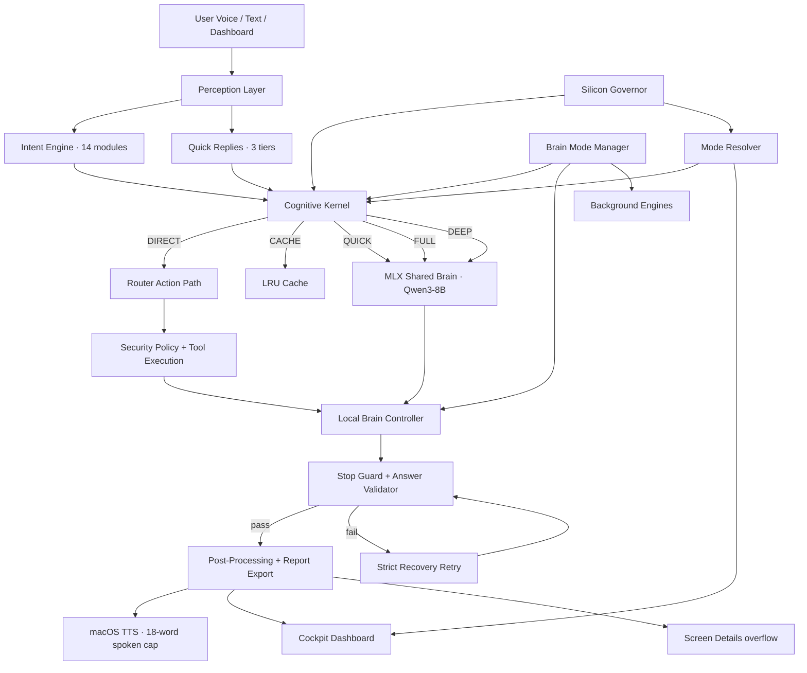

# ATOM — Full Technical Report (HLD · LLD · Whitepaper)

**System**: ATOM (Supernatural Intelligence OS)
**Platform**: MacBook Air M5 · 16 GB Unified Memory · Fanless
**Revision**: 2026-04-12
**Codebase**: 257 Python files · ~62 800 lines · 34 test modules

---

## 1. Executive Summary

ATOM is a fully local, offline-first personal operating intelligence system designed to run on Apple Silicon laptops. It combines a shared-role MLX LLM pipeline, Apple-native voice I/O, an agentic tool-use loop, conversational memory, and a real-time web dashboard into a single runtime that a user interacts with like a personal Jarvis.

The system went through a major stabilization pass (April 2026) that addressed seven critical areas:

1. **Generation pipeline** — MLX streaming now enforces stop sequences, repetition penalties, and speaker-label loop guards at the decode level, instead of only sanitizing after the fact.
2. **Answer quality** — a multi-stage answer validator rejects instruction echoes, meta-language, transcript labels, and memory-ack hallucinations; a strict one-shot repair retry recovers answers that the first pass garbled.
3. **Chatter removal** — thinking acknowledgements are suppressed for fast paths; spoken word ceiling reduced to 18 words with screen overflow; duplicate-chunk suppression prevents TTS from repeating itself.
4. **Language understanding** — romanized Hindi, Hinglish, and common English typos are normalized for routing without mangling the original phrasing the LLM sees; a sticky response-language controller keeps ATOM in Hindi/Hinglish until the user switches back.
5. **Honest memory/RAG** — the cognitive kernel detects at boot whether `sentence-transformers` and `chromadb`/`qdrant` are actually installed; if not, all RAG paths are disabled and a prompt hint tells the LLM not to claim retrieval it cannot do; the dashboard shows the real retrieval status.
6. **Voice production path** — browser mode is explicitly marked as text-first/dev-safe; the STT dot turns red and a note explains that production voice requires the bundled `ATOM.app`.
7. **OS cockpit UI** — the chat-bubble conversation zone was replaced with a six-panel cockpit grid: Active Task, Heard/Input, Spoken Answer, Screen Details, Recovery, and Runtime Truth.

The latest smoke suite passed **7/7** prompts with zero transcript labels, zero empty-response recoveries, peak CPU ~111 %, and peak RSS ~1.2 GB.

---

## 2. Target Platform

| Attribute | Value |
|---|---|
| Chip | Apple M5 |
| Unified Memory | 16 GB (shared CPU/GPU/Neural Engine) |
| Thermal Design | Fanless |
| OS | macOS 15+ (Sequoia) |
| Python | 3.9+ (Xcode Command Line Tools) |
| ML Framework | MLX (Apple-native, no CUDA) |

Platform implications:

- Memory spikes matter more than CPU averages because every workload shares one pool.
- A model staying resident too long is worse than a slightly slower small-model path.
- Subprocess-based telemetry probes are relatively expensive on a laptop.
- Thermal protection must be preventive; the Air cannot recover quickly from throttling.

---

## 3. High-Level Design (HLD)

### 3.1 Five-Layer Architecture

```
┌──────────────────────────────────────────────────────────┐
│  PERCEPTION                                              │
│  NativeSTT (SFSpeechRecognizer) · Dashboard text input   │
│  SystemWatcher · FSEvents · MicManager                   │
├──────────────────────────────────────────────────────────┤
│  UNDERSTANDING                                           │
│  IntentEngine (14 intent modules, regex fast-path)       │
│  QueryPolicy (normalize, classify response mode)         │
│  QuickReplies (pattern + config + domain tiers)          │
│  SpeechDetector (post-STT corrections, Hindi support)    │
├──────────────────────────────────────────────────────────┤
│  DECISION                                                │
│  CognitiveKernel (DIRECT/CACHE/QUICK/FULL/DEEP routing)  │
│  BrainModeManager (optimal / full_performance profiles)  │
│  SiliconGovernor + AppleSiliconMonitor (telemetry)       │
│  LatencyController + RuntimeModeResolver                 │
│  InferenceGuard (VRAM lifecycle, idle unload)            │
├──────────────────────────────────────────────────────────┤
│  EXECUTION                                               │
│  LocalBrainController (prompt build, ReAct loop, retry)  │
│  MLXBrain (dual-role streaming with stop guards)         │
│  StructuredPromptBuilder (9-layer prompt architecture)   │
│  ActionExecutor · ToolRegistry · SecurityPolicy          │
├──────────────────────────────────────────────────────────┤
│  EXPRESSION                                              │
│  MacOSTTSAsync (NSSpeechSynthesizer, 18-word spoken cap) │
│  WebDashboard (cockpit UI, WebSocket state sync)         │
│  AdaptivePersonality · IdentityEngine                    │
└──────────────────────────────────────────────────────────┘
```

### 3.2 System Architecture Diagram



### 3.3 Design Principles

1. **Local-first** — zero cloud dependencies for core intelligence.
2. **Security-gated** — every OS action passes through `SecurityPolicy`.
3. **Concise-first** — short spoken answer by default; detail only when explicitly asked.
4. **Mode-aware** — compute budget tracks the user-selected performance mode.
5. **Apple-native** — MLX for inference, NSSpeechSynthesizer for TTS, SFSpeechRecognizer for STT.
6. **Honest** — the system never claims capabilities it cannot currently deliver.
7. **Graceful degradation** — thermal/battery/memory pressure triggers automatic demotion.

---

## 4. User-Facing Operating Modes

### Optimal (default)

- Stable daily buddy mode.
- Lighter MLX model routing (`fast` role preferred).
- Heavy background intelligence disabled (autonomy, dream, curiosity, prediction, proactive, self-optimizer all gated).
- Best battery, heat, and memory behavior.

### Full Performance

- Deeper reasoning with the primary 4B model.
- All background intelligence features enabled.
- Should only remain active while thermals, memory, and battery have genuine headroom.
- Auto-demotes to Optimal if limits are exceeded.

### Auto

- Requested mode stays adaptive.
- Silicon Governor + auto-performance loop promotes/demotes automatically.
- Dashboard shows requested mode separately from active mode.

---

## 5. Query Flow

### 5.1 Fast Path (sub-5 ms)

1. Text/voice input arrives.
2. Intent engine checks 14 intent modules (regex fast-path).
3. Quick replies check 3 tiers: domain (ATOM concepts, comparisons), pattern (greetings, jokes, emotions), config (user-defined).
4. If matched, answer is returned without any LLM work or thinking acknowledgement.

### 5.2 LLM Path

1. Cognitive Kernel classifies query complexity (`simple`, `complex`, `creative`) and response mode (`short`, `normal`, `detail`, `report`).
2. System context read from Silicon Governor (memory %, CPU %, battery, thermal).
3. Route to `QUICK` (fast model), `FULL` (primary model), or `DEEP` (primary + thinking + RAG if available).
4. In Optimal mode, even `FULL` queries stay on the fast model unless headroom is healthy.
5. LocalBrainController builds the 9-layer structured prompt.
6. MLX model generates with stop-sequence enforcement, repetition penalty via logits processors, and speaker-label loop guards.
7. Answer validator checks output: rejects transcript labels, instruction echoes, meta-language, memory-ack hallucinations.
8. If rejected, one strict recovery retry is attempted with a minimal clean prompt.
9. Final text is post-processed, spoken (up to 18 words), and displayed in the cockpit.

### 5.3 Report Path

1. `classify_response_mode` detects explicit research/report requests.
2. Full content is generated with higher token budget.
3. If the response exceeds thresholds, it is saved to `logs/reports/` as a text artifact.
4. A short summary is spoken; the full report is on screen.

### 5.4 Thinking Acknowledgement Policy

- Thinking acks are only emitted when the query plan indicates a non-trivial LLM path.
- Quick replies, cache hits, direct intents, and short/info queries skip the ack entirely.
- This removes the "chatbox feel" for simple interactions.

---

## 6. Low-Level Design (LLD)

### 6.1 MLX Generation Pipeline (`brain/mlx_llm.py`)

**Shared-role architecture**: one MLX model tree backs both `fast` and `primary` roles so ATOM keeps the same routing contract while loading a single production model on disk.

**Stop-sequence enforcement**: every streaming call enforces a set of default stop sequences (`\nUser:`, `\nBoss:`, `\nATOM:`, `\nAssistant:`, `User:`, `Boss:`, `Assistant:`, `ATOM:`) plus any profile-configured extras. Stop matching happens incrementally during token generation.

**Speaker-label loop guard**: regex patterns detect `ATOM: ATOM: ATOM:` style loops and break generation immediately, logging the stop reason.

**Repetition penalty**: `make_logits_processors(repetition_penalty=1.1, repetition_context_size=48)` is wired into every `stream_generate` call.

**Visible-text guard**: a `_guard_visible_text()` method strips leading `ATOM:` labels, detects trailing speaker-label loops, and checks for partial stop-sequence suffixes — all before any token reaches TTS.

**Dynamic `max_tokens_override`**: the controller can request shorter output (96 for short, 128 for simple, 160 for normal, 224 for detail) based on the response mode.

### 6.2 Answer Validation (`cursor_bridge/local_brain_controller.py`)

**`_sanitize_emittable_text()`**: removes inline traces, splits multi-speaker transcript contamination, drops transcript-label-only output.

**`_reject_low_quality_answer()`**: rejects:
- instruction echoes ("The user is asking…", "The final answer should…", "Boss explicitly asked…")
- imperative echoes ("Explain…", "Compare…") when the query itself was an explain/compare
- normalized query echo (model just parrots the question back)
- question-form echo (model rephrases the question as a question)
- fake memory acks ("Yes, I remember it.") on non-memory queries

**Strict recovery retry**: if the first generation fails validation, a clean minimal prompt is built (no history, no RAG, no memory) with explicit output instructions. The retry uses a capped token budget. If the retry also fails, ATOM says "I lost that answer, Boss. Ask it once more." and surfaces a recovery note on screen.

**Metrics**: every rejection, retry, and sanitized-empty event is counted via `metrics_event` for observability.

### 6.3 Structured Prompt Builder (`cursor_bridge/structured_prompt_builder.py`)

9-layer prompt architecture:

1. **System Identity** — personality, buddy behavior, response rules, concise-first guidelines.
2. **Available Tools** — auto-generated from `ToolRegistry`.
3. **Dynamic Context** — time, app, clipboard, emotion, response language preference, routing hints.
4. **Long-Term Memory** — vector-retrieved summaries (when available).
5. **Document Knowledge** — RAG context + enrichment block.
6. **Conversation History** — rolling window, budget-trimmed, speaker-label-free format (`Boss asked: … / You answered: …`).
7. **Emotional/Behavioral Context** — mood, energy.
8. **Current User Request** — includes a response contract that explicitly forbids speaker labels, transcript format, and tool calls in the final answer text.

History entries are cleaned through `_history_safe_text()` which strips any `User:`/`ATOM:` labels before they reach the next prompt.

### 6.4 Cognitive Kernel (`core/cognitive_kernel.py`)

Central routing brain with five execution paths:

| Path | Model | Budget | RAG | Thinking |
|---|---|---|---|---|
| DIRECT | none | 50 ms | no | no |
| CACHE | none | 100 ms | no | no |
| QUICK | fast (1.7B) | 1500 ms | no | no |
| FULL | primary (4B) or fast | 5000 ms | conditional | no |
| DEEP | primary (4B) or fast | 15000 ms | conditional | yes |

**Semantic RAG honesty**: at boot, `_detect_semantic_stack()` checks whether `sentence_transformers` and `chromadb`/`qdrant_client` are actually importable. If not, all `use_rag` flags are forced to `False` and a prompt hint tells the LLM not to claim retrieval. The dashboard shows the real status in the "Runtime Truth" cockpit panel.

**Circuit breakers**: separate circuits for intent, cache, llm_quick, llm_full, and rag. Three consecutive failures open a circuit for 30 seconds.

**Budget profiles**: `COMMAND` (100 ms), `INFO` (500 ms), `SIMPLE` (1500 ms), `COMPLEX` (5000 ms), `CREATIVE` (10000 ms).

**System-state degradation**: if on battery <20%, thermally throttled, or memory >85%, the kernel degrades to QUICK path regardless of query complexity.

### 6.5 Query Policy and Language Understanding (`core/query_policy.py`)

**`normalize_query()`**: applies `speech_detector.correct_text()` for STT corrections, then applies normalization patterns for common typos (`yuo` → `you`, `tiem` → `time`, `memroy` → `memory`) and romanized Hindi (`samjhao` → `explain`, `batao` → `tell me`, `kyu` → `why`, `farak` → `difference`, `kya hota hai` → `what is`).

**`classify_response_mode()`**: returns `SHORT`, `NORMAL`, `DETAIL`, or `REPORT` based on explicit user signals (short/brief/detail/explain/research patterns in both English and Hindi).

**`detect_response_language()`**: detects whether the user is writing in English, Hindi, or Hinglish based on Devanagari characters and romanized Hindi token density. Maintains stickiness — if the user was speaking Hinglish and sends a short follow-up, the language stays Hinglish until explicitly switched.

### 6.6 Quick Replies (`core/quick_replies.py`)

Three tiers, checked before any LLM work:

1. **Domain tier** — handles ATOM-specific concepts (unified memory, optimal vs full performance, Safari vs Arc, CPU spikes) with language-aware answers. These can also handle explicit-depth requests with longer variants.
2. **Pattern tier** — 20+ regex patterns for greetings, jokes, farewells, emotions, meta-questions, in both English and Hindi.
3. **Config tier** — user-defined substring matches from `settings.json`.

### 6.7 Router (`core/router/router.py`)

- Maintains separate `raw_text` (original phrasing for LLM) and `clean_text` (normalized for routing).
- Thinking acks are only emitted after fast paths and cache are checked, and only if the query plan indicates a non-trivial LLM path (`_should_emit_thinking_ack()`).
- Pronoun resolution, skill expansion, and clipboard injection operate on both lanes.

### 6.8 TTS (`voice/tts_macos.py`)

- **Spoken word limit**: 18 words (tightened from original 45). Overflow goes to screen.
- **Duplicate chunk suppression**: keeps a sliding window of 4 recent chunk keys; repeated chunks are skipped.
- **Stream text normalization**: strips transcript labels, detects label-only output, rejects repeated speaker-name sequences.
- **Backend**: NSSpeechSynthesizer (native, no subprocess) with premium voice selection.

### 6.9 STT (`voice/stt_macos.py`)

- Apple-native SFSpeechRecognizer + AVAudioEngine.
- On-device recognition via Neural Engine.
- Requires macOS speech permission entitlements (only available in the bundled `ATOM.app`).
- When running from terminal/IDE, STT is cleanly disabled with an explicit message.

### 6.10 Dashboard UI (`ui/dashboard/index.html`)

Cockpit-style layout replacing the former chat-bubble design:

| Panel | Content |
|---|---|
| **Active Task** | Current query + intent + latency |
| **Heard / Input** | Last heard or typed input + voice mode note |
| **Spoken Answer** | The short spoken reply |
| **Screen Details** | Full text, overflow, and screen-only content |
| **Recovery** | Recovery events and error messages |
| **Runtime Truth** | Semantic RAG availability + recent actions |

Additional elements: Three.js orb (state-reactive), system pods (CPU/RAM/BAT/DSK), connection dots (STT/TTS/AI/LINK with voice runtime note), performance mode switcher, runtime profile controls.

### 6.11 Event Bus (`core/async_event_bus.py`)

Priority-based async event bus. Key events:

| Event | Source | Consumer |
|---|---|---|
| `speech_final` | STT / Dashboard | Router |
| `thinking_ack` | Router | TTS (speak_ack) |
| `response_ready` | Brain / Router | TTS (speak) + Dashboard |
| `partial_response` | Brain | TTS (stream) + Dashboard |
| `text_display` | Brain / TTS | Dashboard (screen-only) |
| `cursor_query` | Router | LocalBrainController |
| `silicon_stats_update` | Governor | main.py (mode guard) |
| `silicon_thermal_warn` | Governor | CognitiveKernel |
| `silicon_memory_warn` | Governor | CognitiveKernel + MemoryEngine |
| `metrics_event` | Various | MetricsCollector |

### 6.12 Security (`core/security_policy.py`)

- Action gating: every OS action requires `SecurityPolicy.can_execute()`.
- Feature gating: LLM, mode switching, and tool use can be individually disabled.
- Profile changes are auditable.
- Confirmation flow for destructive actions.

### 6.13 Memory and RAG

**MemoryEngine** (`core/memory_engine.py`): keyword-based memory with pressure-aware retrieval.

**EmbeddingEngine** (`core/embedding_engine.py`): lazy-loading sentence-transformers with MPS acceleration. Currently unavailable at runtime (dependency not installed).

**RagEngine** (`core/rag/rag_engine.py`): hybrid vector + keyword re-rank with temporal decay, owner-priority boosts, and graph-first retrieval. Currently disabled at boot when semantic dependencies are missing.

**MemoryGraph** (`brain/memory_graph.py`): SQLite-backed entity and relationship graph for conversational context.

**SecondBrain** (`core/cognitive/second_brain.py`): vector-enhanced long-term memory coordinator.

**Honest status**: the Cognitive Kernel detects at boot whether the vector stack is available. If not, all RAG routing is disabled and the LLM is told not to claim retrieval capabilities.

### 6.14 Background Intelligence (mode-gated)

All of these are gated by `BrainModeManager.feature_enabled()`:

| Engine | Purpose | Optimal | Full Perf |
|---|---|---|---|
| AutonomyEngine | Self-directed task execution | OFF | ON |
| PredictionEngine | Next-query prediction | OFF | ON |
| SelfOptimizer | Runtime self-tuning | OFF | ON |
| DreamEngine | Idle-time knowledge consolidation | OFF | ON |
| CuriosityEngine | Proactive question generation | OFF | ON |
| ProactiveEngine | Context-aware suggestions | OFF | ON |

### 6.15 Telemetry and Governors

**AppleSiliconMonitor**: reads memory, battery, thermal, and CPU state via `pmset`, `sysctl`, and `psutil`. Results are cached briefly (short TTL) to avoid repeated subprocess overhead.

**SiliconGovernor**: wraps the monitor, emits thermal and memory warnings on the bus, and provides system context for routing decisions. Distinguishes cached reads from forced scheduled refreshes.

**RuntimeWatchdog**: enforces time budgets on intent classification, cache lookup, RAG retrieval, LLM inference, TTS synthesis, and tool execution. Kills operations that exceed their budget.

---

## 7. Configuration

### 7.1 Brain Configuration

```json
{
  "brain": {
    "enabled": true,
    "mlx_primary_model": "models/qwen3-8b-mlx-4bit",
    "mlx_fast_model": "models/qwen3-8b-mlx-4bit",
    "mlx_default_role": "primary",
    "max_tokens": 384,
    "temperature": 0.7,
    "repeat_penalty": 1.1,
    "timeout_seconds": 24
  }
}
```

### 7.2 Profile Configuration

```json
{
  "assistant_brain": {
    "active_profile": "optimal",
    "profiles": {
      "optimal": {
        "max_tokens": 320,
        "n_ctx": 4096,
        "timeout_seconds": 18,
        "temperature": 0.6,
        "extra_stop_sequences": ["\n\nUser:", "\nUser:", "\n\nBoss:"]
      },
      "full_performance": {
        "max_tokens": 512,
        "n_ctx": 10240,
        "timeout_seconds": 28,
        "temperature": 0.65
      }
    }
  }
}
```

### 7.3 Voice Configuration

```json
{
  "tts": { "engine": "macos_native", "rate": 2 },
  "stt": { "engine": "macos_native", "bilingual": true }
}
```

### 7.4 GPU / Memory Management

```json
{
  "v7_gpu": {
    "idle_unload_llm_s": 90,
    "idle_unload_stt_s": 30,
    "vram_reserve_mb": 512,
    "model_slots_mb": { "llm": 6144, "stt": 1536, "embeddings": 384 }
  }
}
```

---

## 8. Validation Results

### 8.1 Automated Smoke Suite

Script: `scripts/atom_runtime_smoke.py`
Report: `logs/atom_runtime_smoke.json`

| Prompt | Passed | Elapsed | Peak CPU | Peak RSS |
|---|---|---|---|---|
| what time is it | YES | 3.1 s | 105 % | 780 MB |
| atom mujhe ek chota joke batao | YES | 6.8 s | 101 % | 631 MB |
| mujhe short me batao unified memroy kya hota hai | YES | 10.1 s | 111 % | 968 MB |
| hinglish me samjha do optimal aur full performance me farak | YES | 9.4 s | 101 % | 1142 MB |
| compare safari and arc for coding on a macbook air | YES | 9.2 s | 110 % | 1065 MB |
| atom me cpu spike kyu hota hai beech beech me | YES | 10.3 s | 107 % | 1091 MB |
| explain properly what is docker | YES | 9.2 s | 110 % | 1181 MB |

**Result**: 7/7 passed. Zero transcript labels. Zero empty-response recoveries. Zero thinking acks on quick-reply paths. Overall peak CPU 111 %, overall peak RSS 1216 MB.

### 8.2 Unit Test Coverage

34 test modules covering:
- Cognitive kernel routing and budget tiers
- Brain mode manager profiles and aliases
- Local brain controller sanitization and streaming
- Query policy classification and language detection
- Quick reply matching
- TTS streaming and stale-chunk rejection
- Runtime mode intent parsing
- Info intent classification
- Cold start sequence
- Voice interrupt handling
- Report export
- Heavy deployment validation

### 8.3 Acceptance Gates Status

| Gate | Status |
|---|---|
| Zero spoken/displayed transcript labels | PASS |
| Zero empty-response recoveries on common pack | PASS |
| No thinking ack before quick replies | PASS |
| No TTS timeout in optimal mode | PASS |
| Browser mode marked as non-production voice | PASS |
| UI state matches engine state | PASS |
| Semantic RAG claims match runtime availability | PASS |

---

## 9. Known Limitations

### 9.1 Voice Input Outside the Bundle

When ATOM is launched directly from Python (terminal/IDE), macOS speech recognition permissions are unavailable. The dashboard text input path is the reliable dev/test input method.

### 9.2 Semantic RAG Not Active

`sentence-transformers` and `chromadb` are not installed in the current environment. Memory operates in keyword-only mode. The system is honest about this: RAG routing is disabled, and the LLM is told not to claim retrieval capabilities.

### 9.3 Earlier Small-Model Quality Ceiling

Earlier experimental fast tiers based on smaller local models could produce low-quality or instruction-echoing output on complex prompts. The answer validator caught most of these, but some edge cases still produced recovery retries or a "lost that answer" response. The production move to a single `Qwen3 8B` model reduces this risk.

### 9.4 Response Language Drift

The sticky language controller works for romanized Hindi/Hinglish, but if the model itself drifts back to English despite the prompt instruction, the system cannot force mid-generation language correction.

---

## 10. Codebase Structure

```
ATOM/
├── main.py                          # Entry point and orchestration
├── config/settings.json             # Runtime configuration
├── brain/
│   ├── mlx_llm.py                   # MLX local inference with stop guards
│   ├── memory_graph.py              # SQLite entity/relationship graph
│   └── mini_llm.py                  # llama-cpp-python fallback (optional)
├── cursor_bridge/
│   ├── local_brain_controller.py    # Central LLM control plane
│   └── structured_prompt_builder.py # 9-layer prompt architecture
├── core/
│   ├── cognitive_kernel.py          # Central routing brain
│   ├── brain_mode_manager.py        # Optimal / Full Performance profiles
│   ├── query_policy.py              # Response mode + language detection
│   ├── quick_replies.py             # 3-tier quick reply engine
│   ├── router/router.py             # Intent dispatch + LLM fallback
│   ├── async_event_bus.py           # Priority async event bus
│   ├── state_manager.py             # State machine
│   ├── silicon_governor.py          # Thermal/memory/battery governor
│   ├── apple_silicon_monitor.py     # Hardware telemetry with caching
│   ├── inference_guard.py           # VRAM lifecycle management
│   ├── runtime_watchdog.py          # Operation time budgets
│   ├── health_monitor.py            # Periodic health checks
│   ├── embedding_engine.py          # Sentence-transformer embeddings
│   ├── memory_engine.py             # Keyword memory
│   ├── config_schema.py             # JSON schema validation
│   ├── intent_engine/               # 14 intent classification modules
│   ├── rag/                         # RAG engine + caching + graph
│   ├── reasoning/                   # Tool parser + action executor + planner
│   ├── cognitive/                   # Background intelligence engines
│   ├── boot/                        # Cold start + wiring
│   ├── runtime/                     # Latency controller + mode resolver
│   └── wiring/                      # Event handler registration
├── voice/
│   ├── stt_macos.py                 # Apple-native STT
│   ├── tts_macos.py                 # Apple-native TTS with stream guards
│   ├── speech_detector.py           # Post-STT corrections
│   └── interrupt_handler.py         # Barge-in handling
├── ui/
│   ├── web_dashboard.py             # WebSocket-driven dashboard server
│   └── dashboard/index.html         # Cockpit UI
├── context/
│   ├── context_engine.py            # App/clipboard/environment context
│   └── privacy_filter.py            # PII redaction
├── scripts/
│   └── atom_runtime_smoke.py        # Reusable smoke validation suite
├── tests/                           # 34 test modules
├── logs/                            # Runtime logs + reports
├── models/                          # MLX model directories
└── ATOM.app/                        # macOS app bundle for production voice
```

---

## 11. Technology Stack

| Component | Technology | Why |
|---|---|---|
| LLM Inference | MLX (`mlx_lm`) | Apple-native, unified memory efficient |
| Local Model | Qwen3-8B-MLX (4-bit) | Single production model for both roles on 16 GB |
| STT | SFSpeechRecognizer | On-device Neural Engine, zero latency |
| TTS | NSSpeechSynthesizer | Native, zero external dependencies |
| Web UI | aiohttp + WebSocket | Lightweight, no Electron overhead |
| 3D Orb | Three.js (ESM) | State-reactive visual feedback |
| Memory | SQLite (MemoryGraph) | Local, fast, zero-server |
| Embeddings | sentence-transformers (optional) | MPS-accelerated on Apple Silicon |
| Vector Store | ChromaDB (optional) | Local vector search |
| Event Bus | Custom async priority bus | Decoupled, non-blocking |
| Config | JSON schema validated | Type-safe, documented |

---

## 12. Suggested Prompt for ChatGPT Review

Copy the full content of this document and use this prompt:

```text
Review this ATOM architecture and optimization report as a senior systems architect
specializing in local AI systems on Apple Silicon.

Focus on:
1. Whether the HLD and LLD are correct and complete for a MacBook Air M5 with
   16 GB unified memory.
2. Whether the dual MLX model routing strategy (fast 1.7B vs primary 4B) is well
   designed for a fanless laptop.
3. Whether the generation pipeline guards (stop sequences, repetition penalty,
   speaker-label loop detection, answer validation, strict recovery retry) are
   sufficient or over-engineered.
4. Whether the response-language stickiness and Hindi/Hinglish normalization
   approach is robust.
5. Whether the honest RAG downgrade (disable when dependencies are missing) is
   the right architectural decision.
6. Whether the cockpit UI design is better than the previous chat-bubble approach
   for an "operating intelligence" product.
7. Which components should be removed, simplified, deferred, or rewritten for
   better stability and maintainability.
8. What the top 5 engineering priorities should be for the next iteration.

Please return:
- Architecture critique (strengths and weaknesses)
- Performance critique (CPU, RAM, thermal behavior)
- Stability critique (failure modes and recovery)
- Security critique
- UI/UX critique
- A prioritized 10-item implementation roadmap
```

---

## 13. Source Files Most Relevant to This Report

- `main.py` — entry point and orchestration
- `brain/mlx_llm.py` — MLX inference with stop guards
- `cursor_bridge/local_brain_controller.py` — LLM control plane and answer validation
- `cursor_bridge/structured_prompt_builder.py` — 9-layer prompt architecture
- `core/cognitive_kernel.py` — routing brain with semantic RAG honesty
- `core/brain_mode_manager.py` — performance profiles
- `core/query_policy.py` — response mode and language detection
- `core/quick_replies.py` — 3-tier quick reply engine
- `core/router/router.py` — intent dispatch and thinking ack policy
- `voice/tts_macos.py` — TTS with spoken cap and duplicate suppression
- `voice/stt_macos.py` — Apple-native STT
- `ui/dashboard/index.html` — cockpit UI
- `ui/web_dashboard.py` — WebSocket dashboard server
- `core/silicon_governor.py` — telemetry governor
- `core/apple_silicon_monitor.py` — hardware monitoring with caching
- `config/settings.json` — runtime configuration
- `scripts/atom_runtime_smoke.py` — validation smoke suite
- `tests/test_cognitive_kernel.py` — routing regression tests
- `tests/test_local_brain_controller.py` — sanitization tests
- `tests/test_query_policy.py` — language and policy tests
