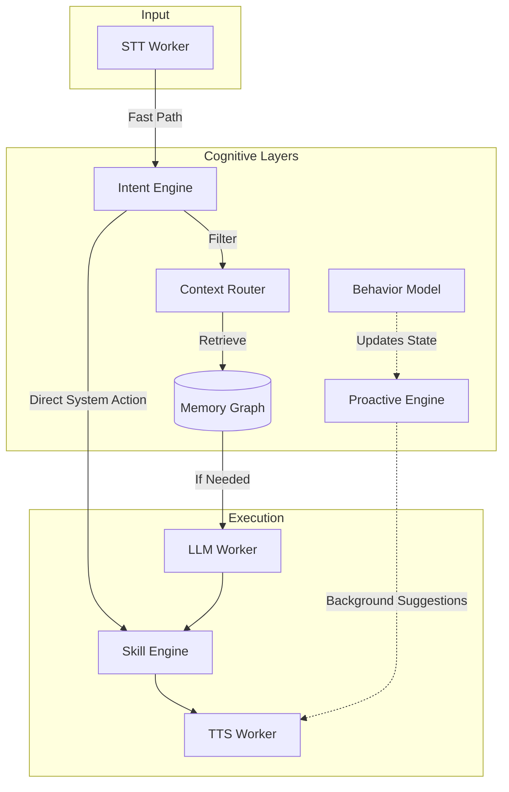

# ATOM V4 Cognitive OS Blueprint

## Overview
ATOM V4 transitions the system from a reactive V3 architecture (Input → Process → Output) to a true Cognitive OS (Observe → Understand → Predict → Act → Learn). This upgrade introduces a multi-layered Brain architecture designed to minimize LLM dependency, reduce latency, and enable true Jarvis-like proactive capabilities.

## Architecture: The Brain Layers

1. **Intent Engine (Brain Layer 1)**
   - Converts raw input into structured intent (type, confidence, entities, urgency).
   - Removes unnecessary LLM calls by handling system, chat, task, and automation intents directly.

2. **Context Router (Brain Layer 2)**
   - Decides what context goes to the LLM based on intent.
   - Solves context overload and latency by injecting only relevant memory (e.g., minimal context for system intents, task memory for task intents).

3. **Memory Graph (Brain Layer 3)**
   - Replaces flat logs with a graph-based memory structure (e.g., User → works_on → project_X).
   - Supports Episodic (past sessions), Semantic (facts about user), and Procedural (workflows) memory types.

4. **Behavior Model (Brain Layer 4)**
   - Tracks user patterns (focus, work hours, tool usage, stress).
   - Enables prediction by maintaining a real-time `UserState`.

5. **Proactive Engine (Jarvis Core)**
   - Runs in the background, analyzing state and predicting next actions.
   - Decides whether to suggest, act, or stay silent.

6. **Skill Engine (Tool Intelligence Layer)**
   - Groups raw tools into structured macro-skills (e.g., `development_start` = open VSCode + start backend + open docs).

## Data Flow Pipeline



## Performance Strategy
1. **LLM is LAST, not FIRST**: Use the LLM only when necessary.
2. **Cache everything**: System state, memory lookups, and intent results.
3. **Parallel execution**: Memory retrieval and context building.

## Personality Upgrade
- Use dynamic tone based on emotion, context, and history.
- Avoid scripted, fixed responses. Aim for realistic, human-like interactions.

---

## ATOM V4 Evolve Prompt

Use this prompt to continue evolving the system:

```text
I am building ATOM V4, a Personal Cognitive AI Operating System that runs fully offline on a multi-process architecture using ZeroMQ, with STT, LLM, and TTS isolated into separate workers.

The system currently includes:
* ZMQ-based distributed event bus
* Proxy-based orchestration
* Context fusion engine
* Adaptive personality system
* Tool registry with secure execution

I want you to act as a Principal AI Systems Architect and evolve this system further.

Focus on:
1. Cognitive Intelligence:
* Improve the Intent Engine to reduce dependency on the LLM
* Design a Context Router that dynamically selects only relevant context
* Prevent “lost in the middle” issues in long sessions

2. Memory System:
* Design a scalable Memory Graph (episodic, semantic, procedural)
* Suggest efficient storage + retrieval strategies for low latency
* Ensure memory evolves with user behavior

3. Proactive Intelligence:
* Design a Proactive Engine that predicts user intent
* Define when ATOM should act vs suggest vs stay silent
* Avoid annoyance while increasing usefulness

4. Distributed System Stability:
* Improve ZeroMQ reliability (ordering, retries, tracing)
* Handle multi-process interrupts and failures safely
* Prevent message loss and race conditions

5. Performance Optimization:
* Reduce end-to-end latency below 500ms
* Optimize GPU/CPU usage across processes
* Improve streaming coordination between LLM and TTS

6. Modularity & Future Scaling:
* Suggest how to scale this system across multiple machines in future
* Recommend clean module boundaries for long-term maintainability

Give:
* architectural improvements
* specific design patterns
* code-level suggestions where necessary

Think like you are designing the next-generation local AI OS (Jarvis-level system).
```
