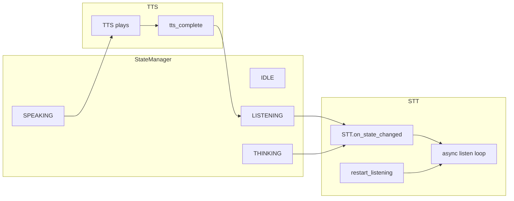

# Voice pipeline — single ownership model

This document is the **canonical** reference for how ATOM starts and stops speech recognition relative to `AtomState`, TTS, and recovery events. Implementation lives in [`voice/stt_macos.py`](../../voice/stt_macos.py), [`voice/stt_async.py`](../../voice/stt_async.py), [`core/boot/wiring.py`](../../core/boot/wiring.py), and [`main.py`](../../main.py).

## Flow diagram

**Native macOS (`NativeSTT`):** the long-lived loop is `async_start_listening()` → inner `start_listening()` (mic + `SFSpeechRecognizer`). After startup TTS, reopening the mic waits until `AtomState.LISTENING` and applies `stt.post_tts_cooldown_ms` when transitioning `SPEAKING → LISTENING`. Optional **`stt.barge_in_during_speak`**: when `true`, the mic may also open during `SPEAKING` so user speech can interrupt TTS (see [`VOICE_RELIABILITY_ROADMAP.md`](VOICE_RELIABILITY_ROADMAP.md)).

**Bluetooth / default input:** `AVAudioEngine` uses the **system default input** (macOS Sound settings), not [`MicManager`](../../voice/mic_manager.py)’s PyAudio-picked device. For earbuds, set the BT input as default before testing. See [`docs/operations/BLUETOOTH_VOICE_TEST.md`](../operations/BLUETOOTH_VOICE_TEST.md).

**Do not** `await async_start_listening()` from [`main.py`](../../main.py) startup greeting — that duplicated the loop and raced TTS (fixed). Listening is started only via `on_state_changed` and `restart_listening`.

## Entry-point inventory

| Entry | When it runs | Calls `stt.stop()`? | Starts listen loop? | Notes |
|-------|----------------|----------------------|---------------------|--------|
| `StateManager.transition` | Any legal FSM change | No | Indirect | Emits `state_changed`; STT reacts in handler |
| `NativeSTT.on_state_changed` / `STTAsync.on_state_changed` | `state_changed` | **Yes** when leaving `LISTENING` or `SPEAKING` for `THINKING`/`IDLE`/etc. | **Yes** when entering `LISTENING`/`SPEAKING` (create_task → async loop) | Primary owner for **continuous** listen |
| `wiring.on_restart_listening` | `restart_listening` bus event | **Yes** (`stt.stop()` before respawn) | **Yes** (`create_task(async_start_listening)` or `start_listening`) | Recovery / nudge; only acts when state is `LISTENING` |
| `wiring.on_enter_sleep` | `enter_sleep_mode` | **Yes** (`stt.stop()`) | No | Full voice shutdown |
| `VoiceInterruptHandler.interrupt_to_listening` | `resume_listening`, hotkeys | Via state transition | Indirect | Moves state toward `LISTENING`; STT follows `on_state_changed` |

## Grep audit (stragglers)

Legitimate call sites for `async_start_listening` / `start_listening`:

| Location | Role |
|----------|------|
| [`voice/stt_macos.py`](../../voice/stt_macos.py) | `on_state_changed` → `create_task(self.async_start_listening())`; inner `start_listening` inside loop |
| [`core/boot/wiring.py`](../../core/boot/wiring.py) | `restart_listening` → `stop()` then `create_task(start_listener())` |
| [`voice/stt_async.py`](../../voice/stt_async.py) | `on_state_changed` → `create_task(self.start_listening())` (Faster-Whisper path) |
| [`voice/stt_google.py`](../../voice/stt_google.py) | Same pattern for Google STT |
| [`main.py`](../../main.py) | Disabled STT stub (`async_start_listening` no-op) for headless/tests |
| [`tests/test_atom_state_contract.py`](../../tests/test_atom_state_contract.py) | Mocks only |

**Not allowed for new code:** calling `async_start_listening()` from `main.py` boot or random features — extend this table instead.

## Optional future refactor

A `core/voice/voice_session.py` facade (`request_listen_start` / `request_listen_stop`) could centralize `stop` + `create_task` rules; `wiring` and `NativeSTT` would delegate. Not required for v1 if this document + audit stay current.

## Apple-class stack (same public APIs as Siri / Dictation on Mac)

ATOM does **not** embed Apple’s private Siri hotword binary. It **does** use the same **supported** surfaces:

| Capability | API | Config |
|------------|-----|--------|
| On-device speech recognition | `SFSpeechRecognizer` + `AVAudioEngine` | `stt.engine`: `macos_native`, `stt.locale`: `auto` (follows Mac primary locale) |
| On-device neural TTS | `NSSpeechSynthesizer` | `tts.macos_voice`: `system` (uses `NSSpeechSynthesizer.defaultVoice()` — Spoken Content default, Siri-class quality tier) |

**Better than cloud assistants for your Mac:** ATOM adds your **local agentic brain** (tools, ReAct, privacy). Siri/Alexa/Google optimize for their clouds and devices; ATOM optimizes for **your** machine and **your** model.

## See also

- [`09_STATE_MACHINE.md`](09_STATE_MACHINE.md) — `AtomState` transitions  
- [`01_PERCEPTION_LAYER.md`](01_PERCEPTION_LAYER.md) — STT/TTS overview  
- [`08_EVENT_BUS.md`](08_EVENT_BUS.md) — `restart_listening`, `speech_final`
