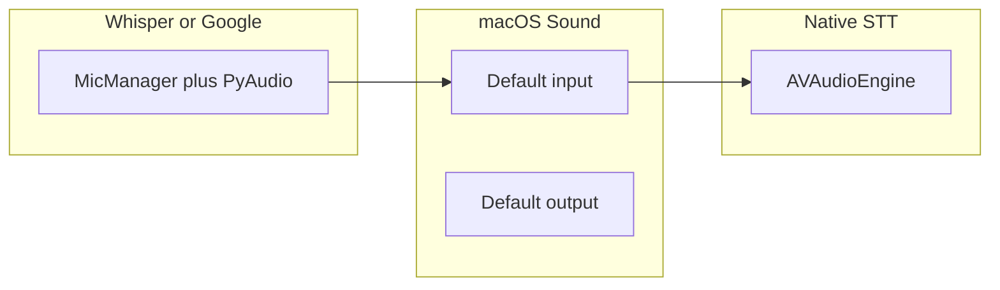

# Bluetooth earbuds — voice test checklist (ATOM)

**Start here:** set **System Settings → Sound → Input** to your Bluetooth device (default input), then launch **`ATOM/ATOM.app`** (double-click in Finder) or **`Run ATOM.command`**. Native STT follows **macOS default input**, not a device picked inside ATOM’s PyAudio profile.

Related docs: [VOICE_IO_HLD_LLD_CHATGPT.md](../architecture/VOICE_IO_HLD_LLD_CHATGPT.md) (§3.4 Bluetooth), [14_VOICE_PIPELINE.md](../architecture/14_VOICE_PIPELINE.md), [VOICE_RELIABILITY_ROADMAP.md](../architecture/VOICE_RELIABILITY_ROADMAP.md).

---

## Why “default input” matters (30 seconds)

| Path | How the mic is chosen |
|------|------------------------|
| **Native STT** (`macos_native`) | **`AVAudioEngine`** uses the **system default input** (same as Sound settings). |
| **Faster-Whisper / Google** | **PyAudio** + [`MicManager`](../../voice/mic_manager.py) + `mic.prefer_bluetooth`. |

`mic.device_name` in settings is **not** wired to native STT today — use **Sound → Input** for native voice.



---

## Phase A — Pre-flight (macOS + permissions)

- [ ] Pair and connect the earbuds; keep them awake (not auto-disconnected).
- [ ] **System Settings → Sound → Input**: select your Bluetooth **headset / hands-free / earbuds** input so it is the **default input** for the Mac.
- [ ] **System Settings → Sound → Output** (recommended): set output to the **same Bluetooth device** so TTS plays in-ear and laptop speakers do not leak into the mic.
- [ ] **Privacy & Security → Microphone**: allow ATOM (or the process you use to launch it).
- [ ] **Privacy & Security → Speech Recognition**: allow ATOM when using native macOS STT.
- [ ] Launch via **[ATOM.app](../../ATOM.app)** or **[Run ATOM.command](../../Run%20ATOM.command)** so `ATOM_LAUNCH_MODE=bundle` and native STT can activate (see architecture docs).
- [ ] In [config/settings.json](../../config/settings.json): keep `mic.prefer_bluetooth` as you prefer for offline/Google paths; start with `stt.barge_in_during_speak: false` until basic listen/speak works.

---

## Phase B — Launch and dashboard

- [ ] Start ATOM; open the web dashboard URL from `logs/atom.log` (`Web dashboard running at …`) if the browser did not open.
- [ ] Confirm **VOICE** connection dot is healthy; read the **voice health strip** (STT line, Speech/Mic permissions, fallback trace if any).
- [ ] In `logs/atom.log`, find **`VOICE_LAUNCH_DIAG:`** — note `ATOM_LAUNCH_MODE`, `ATOM_APP_BUNDLE`, and STT label.

**Log quick-checks** (run from the ATOM repo root):

```bash
grep -E "VOICE_LAUNCH_DIAG|VOICE_INPUT|Web dashboard running" logs/atom.log | tail -20
tail -f logs/atom.log
```

---

## Phase C — Validate audio path (logs)

- [ ] Find a line like **`VOICE_INPUT: mic=…`** — the **mic name should match your Bluetooth input** (or the hands-free profile name macOS exposes).
- [ ] Speak one short command (e.g. “what time is it”); confirm the dashboard or log shows recognition and a response.
- [ ] Watch for repeated **`AVAudioEngine start failed`** or **`Native STT failed`** — if present, reconnect BT or switch to built-in mic once to isolate hardware/profile issues.

```bash
grep "VOICE_INPUT:\|VOICE_DEBUG:" logs/atom.log | tail -30
```

---

## Phase D — Success criteria

- [ ] Dashboard: STT is **not** Disabled; Speech/Mic are **not** `denied` or `bundle_missing_usage_description`.
- [ ] You hear TTS on the expected device (Bluetooth or Mac speakers).
- [ ] At least **one** command is understood end-to-end (intent or LLM path).
- [ ] `atom.log` contains a coherent **`VOICE_INPUT`** line with your expected input device label.

---

## If recognition is poor on Bluetooth

Many headsets use a **narrowband HFP** profile for the microphone. That is a Bluetooth/OS limitation, not only ATOM. Try: quieter room, closer speaking distance, or temporarily **Mac built-in mic** with earbuds only for output to compare.

---

## Tuning (only if needed)

| Symptom | What to try in `config/settings.json` |
|--------|----------------------------------------|
| First word after TTS is cut off | Increase `stt.post_tts_cooldown_ms` (e.g. 550 → 700–900). |
| Extra delay before you can speak | Decrease `post_tts_cooldown_ms` slightly (test carefully). |
| Want to interrupt TTS by speaking | Set `stt.barge_in_during_speak` to `true` (test with earbuds first; echo risk with speakers). |

---

## Operational vs repo note

Steps in Phase A–D are performed **on your Mac**; this file is the checklist. There is **no substitute** for setting **default input** in System Settings when using **native** macOS STT.
